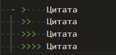
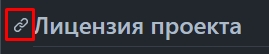
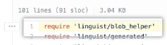

[:arrow_left: Back](https://github.com/Awake-coding/cheat-sheets)

# Markdown синтаксис


1. <details><summary>👈 Заголовок <code>#(1-6)</code></summary><p>

      - # h1 `#`
      - ## h2 `##`
      - ### h3 - h6
    </p><hr></details>


2. <details><summary>👈 Стилизация текста <code>*</code> <code>_</code> <code>~</code></summary><p>

      | Синтаксис | Результат                       |
      | ---       | ---                             |
      | `** **`   | **Жирный** vs Обычный           |
      | `* *`     | *Курсив* vs Обычный             |
      | `**_ _**` | **Жирный и _вложенный курсив_** |
      | `*** ***` | ***Все жирным и курсивом***     |
      | `~~ ~~`   | ~~Зачеркнутый~~                 |
    </p><hr></details>


3. <details><summary>👈 Цитирование текста <code>></code></summary><p>

      - `<blockquote> </blockquote>`
      - 

      - >    Цитата
        >>   Цитата
        >>>  Цитата
        >>>> Цитата
    </p><hr></details>


4. <details><summary>👈 Код <code>` `</code> (однострочный)</summary><p>

      - <code>\` \`</code>
      - `<code> </code>`
    </p><hr></details>


5. <details><summary>👈 Код <code>``` ```</code>, <code>```` ````</code> (многострочный)</summary><p>

    1. ` ``` ``` `
    2. ` ```` ```` ` (4шт <code>`</code> даст возможность отобразить <code>```</code> тройные обратные кавычки)
    3. `<pre><code> </code></pre>` <br><br>

    - Не указан язык
      ```
      document.querySelector('div');
      ```
    - Указан язык JS ([Подсветка синтаксиса языка](https://github.com/github/linguist/blob/master/vendor/README.md))
      ```JS
      document.querySelector('div');
      ```
      ````
      👆```JS
        document.querySelector('div');
      ```
      ````
    </p><hr></details>


6. <details><summary>👈 Ссылки <code>[](Link)</code></summary><p>

    - `[title](Link)`
    - `<a href=""> </a>`
    - Ссылка на репозиторий ['cheat-sheets'](https://github.com/Awake-coding/cheat-sheets)
      - `['cheat-sheets'](https://github.com/Awake-coding/cheat-sheets)`
    - Ссылки на разделы
      - 
    - Абсолютная ссылка
      - `[LICENSE](https://github.com/Awake-coding/cheat-sheets/blob/main/LICENSE.md)`
    - Относительная ссылка
      - `[LICENSE](LICENSE.md)`
    - [Делать ссылки на код](https://docs.github.com/en/get-started/writing-on-github/working-with-advanced-formatting/creating-a-permanent-link-to-a-code-snippet)
        - 
    </p><hr></details>


7. <details><summary>👈 Картинки/файлы <code></code></summary><p>

    - Максимальный размер файла: 10 МБ для изображений, гифок, видео и 25 МБ для всех остальных файлов
    - Поддержка файлов: .png, .gif, .jpg, .svg, .log, .docx, .pptx, .xlsx, .txt, .pdf, .zip, .gz, .mp4, .mov

    - 

      ```html
        
      ```
    - ```markdown
      
      ```
    - Совет: Если вы хотите отобразить изображение, которое находится в вашем репозитории, вы должны использовать относительные ссылки `/assets/images/electrocat.png`
    - Темы, в которой показано изображение:
        - Тему можно задать, в которой будет показано изображение, добавив `#gh-dark-mode-only` или `#gh-light-mode-only` в конец URL-адреса изображения в Markdown.
          - Темная тема
          ```markdown
          
          ```
          - Светлая тема
          ```markdown
          
          ```
    </p><hr></details>


8. <details><summary>👈 Списки <code>-</code>, <code>*</code>, <code>1.-999.</code></summary><p>

    - `- Text` Неупорядоченный список
        - в начале строки поставить `-` или `*`
          - Иногда делать 1 пустую строку перед списком, что бы он заработал
    - `1. Text` Упорядоченный список
        - в начале строки поставить любое число
          - Иногда делать 1 пустую строку перед списком, что бы он заработал
    - Вложенные списки
        ```
        - Пункт списка
            - Пункт вложенного списка
        👆👆 2 таба для вложенного списка
        ```
    1. 1.1 ————— `1. 1.1`
        1. 1.2 ——— `1. 1.2`
            1. 1.3 — `1. 1.3`
            1. 2.3 — `1. 2.3`
        1. 2.2 ——— `1. 2.2`
    </p><hr></details>


9. <details><summary>👈 Списки задач <code>- [ ]</code>, <code>- [x]</code></summary><p>

    - [x] — `- [x]` выполнено
    - [ ] — `- [ ]` задача
    - Если начало текста такого списка `(`, то писать так `- [ ] \() Text`
    </p><hr></details>


10. <details><summary>👈 Эмодзи (emoji) ✌️</summary><p>

    - Всё эмодзи тут [`Emoji - шпаргалка`](https://github.com/ikatyang/emoji-cheat-sheet/blob/master/README.md)
      - [Эмоции](https://github.com/ikatyang/emoji-cheat-sheet/blob/master/README.md#emotion) :speech_balloon: :left_speech_bubble: :blue_heart: :yellow_heart: и тд
      - [Жесты рук, тела](https://github.com/ikatyang/emoji-cheat-sheet/blob/master/README.md#hand-fingers-open) :point_right: :point_left: :point_up_2: :point_down: :wave: :vulcan_salute: :ok_hand: :v: :+1: :-1: :muscle: :eye:
      - [Еда](https://github.com/ikatyang/emoji-cheat-sheet/blob/master/README.md#food-fruit) :banana: :peach: :carrot:
      - [Глобус, карта, здания](https://github.com/ikatyang/emoji-cheat-sheet/blob/master/README.md#place-map) :earth_africa: :globe_with_meridians: :world_map:
      - [Время](https://github.com/ikatyang/emoji-cheat-sheet/blob/master/README.md#time) :hourglass: :alarm_clock:
      - [Погода](https://github.com/ikatyang/emoji-cheat-sheet/blob/master/README.md#time) :fire: :star: :zap: :high_brightness: :sun_with_face:
      - [Деятельность](https://github.com/ikatyang/emoji-cheat-sheet/blob/master/README.md#activities) :dart: :diamonds: :balloon: :trophy: :video_game: :ribbon:
      - [Объекты](https://github.com/ikatyang/emoji-cheat-sheet/blob/master/README.md#objects) :phone: :telephone_receiver: :gem: :desktop_computer: :loud_sound: :floppy_disk: :movie_camera: :camera: :mortar_board: :musical_note: :mag: :mag_right: :cd: :dvd: :crown: :bell:
      - [Книга, деньги, почта, писать](https://github.com/ikatyang/emoji-cheat-sheet/blob/master/README.md#book-paper) :memo: :page_facing_up: :receipt: :green_book: :label: :chart: :moneybag: :envelope: :pencil2:
      - [Офис](https://github.com/ikatyang/emoji-cheat-sheet/blob/master/README.md#office) :open_file_folder: :clipboard: :pushpin: :calendar: :chart_with_upwards_trend: :scissors: :wastebasket:
      - [Замки](https://github.com/ikatyang/emoji-cheat-sheet/blob/master/README.md#lock) :lock:
      - [Инструмент...](https://github.com/ikatyang/emoji-cheat-sheet/blob/master/README.md#tool) :hammer: :wrench: :hammer_and_wrench: :gear: :link: :drop_of_blood: :shopping_cart:
      - [Символы](https://github.com/ikatyang/emoji-cheat-sheet/blob/master/README.md#symbols) :warning: :exclamation: :o: :no_entry: :x: :heavy_check_mark: :white_check_mark: :arrow_right: :arrow_left: :arrow_up: :arrow_down: :arrow_heading_down: :arrow_forward: :arrow_backward: :one: :two: :information_source: :high_brightness: :heavy_plus_sign: :heavy_minus_sign: :fleur_de_lis:
      - [Геометрические](https://github.com/ikatyang/emoji-cheat-sheet/blob/master/README.md#geometric) :radio_button: :green_circle: :red_circle: :orange_circle: :yellow_circle: :black_circle: :large_orange_diamond: :small_orange_diamond: :triangular_flag_on_post:
    </p><hr></details>


11. Переносы `<br>` or `пустая строка(Enter)`


12. Линия `<hr>` or `---` горизонтально прямая


13. Комментарий (скрытый текст) `<!-- -->`


14. Игнор HTML-tag `<>` с помощью `<` — [`&lt;`](https://www.w3schools.com/html/html_entities.asp#:~:text=less%20than-,%26lt%3B) и `>` — [`&gt;`](https://www.w3schools.com/html/html_entities.asp#:~:text=greater%20than-,%26gt%3B)


15. <details><summary>👈 Игнор/экранирование символа в markdown <code>\</code></summary><p>

    - Пример:
        - k и *k* `k и *k*`
        - k и \*k\* `k и \*k\*`
    </p><hr></details>


16. <details><summary>👈 Сноски <code>[^1]</code>, <code>[^1]:</code></summary><p>

    - Простая сноска[^1].
    [^1]: Справка, перевод, толкование, помещаемые в нижней части README

    - Сноска может состоять из нескольких строк[^2].
      [^2]: Эта строка должна заканчиваться 2мя пробелами, а каждая новая строка должна начинаться с двух пробелов.
        Это позволяет вам иметь сноску с несколькими строками.

    - Можно использовать слова в названии сноски, чтобы лучше соответствовать контексту[^note].
    [^note]:
        Именованные сноски по-прежнему будут отображаться с номерами вместо текста, но упрощают идентификацию и связывание.

    - ```
      - Простая сноска[^1].
      [^1]: Справка, перевод, толкование, помещаемые в нижней части README

      - Сноска может состоять из нескольких строк[^2].
      [^2]: Эта строка должна заканчиваться 2мя пробелами, а каждая новая строка должна начинаться с двух пробелов.
        Это позволяет вам иметь сноску с несколькими строками.

      - Можно использовать слова в названии сноски, чтобы лучше соответствовать контексту[^note].
      [^note]:
          Именованные сноски по-прежнему будут отображаться с номерами вместо текста, но упрощают идентификацию и связывание.
      ```

    - ❗ `[^1]:` Текст сноски можно располагать где угодно внизу, после предложения со сноской `[^1]`
    </p><hr></details>


17. <details><summary>👈 Таблицы <code>|</code> + <code>-</code></summary><p>

    - <table>
        <thead align="center">
          <tr> <th>Header</th> <th>Header</th> </tr>
        </thead>
        <tbody>
          <tr> <td>Content Cell</td> <td>Content Cell</td> </tr>
          <tr> <td>Content Cell</td> <td>Content Cell</td> </tr>
        </tbody>
      </table>

                  OR Markdown
      ```
      | Header        | Header        |
      | ---           | ---           |
      | Content Cell  | Content Cell  |
      | Content Cell  | Content Cell  |
      ```

                  OR Html
      ```html
      <table>
        <thead align="center">
          <tr> <th>Header</th> <th>Header</th> </tr>
        </thead>
        <tbody>
          <tr> <td>Content Cell</td> <td>Content Cell</td> </tr>
          <tr> <td>Content Cell</td> <td>Content Cell</td> </tr>
        </tbody>
      </table>
      ```
    - ❗ Доп. информация:
        - `|` вертикальная черта на обоих концах столбца не является обязательным.
        - `| --- |` В каждом столбце, после заголовка, должна быть строка с не менее тремя дефисами.
        - Ячейки могут различаться по ширине и не обязательно их выравнивать друг под другом
        - Форматирование
            - Можно использовать markdown форматирование для стилизации внутри ячеек (текста, писать код, ссылки, картинки, эмодзи, `<br>`, `<hr>`, `\`)
        - Выровнять текст
            - Markdown выравнивание столбца всёх ячеек `:---`, `:---:`, `---:`
            - Html выравнивание через `align="center"`, можно к примеру указать только заголовкам столбцов быть по центру
    </p><hr></details>


18. <details><summary>👈 Свернутый-раздел <code>&lt;details&gt;&lt;summary&gt;</code></summary><p>

    - Такой раздел позволит скрыть любое количество контента между тегами `<details></details>`, до момента клика по заголовку скрытого раздела
    - ````html
      <details><summary>👈 Свернутый-раздел</summary><p>

      - #### Мы можем скрыть что угодно, даже код!
      - ```ruby
          puts "Hello World"
        ```
      </p></details>
      ````
    </p><hr></details>


19. <details><summary>👈 Создание диаграмм <code>syntaxes: mermaid, geoJSON + topoJSON, STL</code></summary><p>

    - [Mermaid](https://docs.github.com/en/get-started/writing-on-github/working-with-advanced-formatting/creating-diagrams#creating-mermaid-diagrams) — отображать блок-схемы, диаграммы последовательности, круговые диаграммы и многое другое ([Официальная документации по Mermaid](https://mermaid-js.github.io/mermaid/#/))
        - [Блок-схемы](https://mermaid-js.github.io/mermaid/#/./flowchart?id=flowcharts-basic-syntax)
          ```mermaid
          graph TD
            A[Начало] --> |что-что| B{Что?}
            B --> |var 1| C(Вариант 1)
            B --> |var 2| D(Вариант 2)
            C --> |end| E[Конец]
            D --> |end| E
          ```
        - [Диаграммы последовательности](https://mermaid-js.github.io/mermaid/#/./sequenceDiagram)
        - [Диаграммы Ганта](https://mermaid-js.github.io/mermaid/#/./gantt)
        - [Диаграммы классов](https://mermaid-js.github.io/mermaid/#/./classDiagram)
        - [Диаграммы отношений сущностей](https://mermaid-js.github.io/mermaid/#/./entityRelationshipDiagram)
        - [Диаграмма пути пользователя](https://mermaid-js.github.io/mermaid/#/./user-journey)
    - [geoJSON и topoJSON](https://docs.github.com/en/get-started/writing-on-github/working-with-advanced-formatting/creating-diagrams#creating-geojson-and-topojson-maps) — создания интерактивных карт
        1. Документация [geoJSON](https://geojson.org/)
            - Создание [online geoJSON](https://geojson.io/#map=2/20.0/0.0)
                - можно сохранять файл в формате `map.geojson`, нужно нажимать `Save` > `GeoJSON`
            - <details><summary>👈 Пример 1 (geojson)</summary><p>

              - С примера [Использование GeoJSON](https://docs.github.com/en/get-started/writing-on-github/working-with-advanced-formatting/creating-diagrams#using-geojson)
              ```geojson
              {
                "type": "Polygon",
                "coordinates": [
                    [
                        [2.608882, 51.437361],
                        [42.856221, 49.767439],
                        [44.633859, -2.175923],
                        [0.939820, -5.955220]
                    ]
                ],
                "properties": {
                  "тут →": "Текст про участок"
                }
              }
              ```
              <!-- верхний левый ([2.608882, 51.437361]) -->
              <!-- верхний правый ([42.856221, 49.767439]) -->
              <!-- нижний правый ([44.633859, -2.175923]) -->
              <!-- нижний левый ([0.939820, -5.955220]) -->
              </p><hr></details>
            - <details><summary>👈 Пример 2 (geojson)</summary><p>

                - Сделано только с помощью [online create geoJSON](https://geojson.io/)
                ```geojson
                {
                  "type": "FeatureCollection",
                  "features": [{
                      "type": "Feature",
                      "properties": {
                        "stroke": "#080808",
                        "stroke-width": 2,
                        "stroke-opacity": 1
                      },
                      "geometry": {
                        "type": "LineString",
                        "coordinates": [
                            [31.81640625, 43.83452678223682],
                            [-62.05078125, 48.45835188280866],
                            [20.56640625, 59.265880628258095]
                        ]
                      }
                  }, {
                      "type": "Feature",
                      "properties": {
                        "marker-color": "#000000",
                        "marker-size": "medium",
                        "marker-symbol": ""
                      },
                      "geometry": {
                        "type": "Point",
                        "coordinates": [3.8671874999999996, 53.85252660044951]
                      }
                  }, {
                      "type": "Feature",
                      "properties": {
                        "stroke": "#000000",
                        "stroke-width": 3,
                        "stroke-opacity": 0.8,
                        "fill": "#7a6c38",
                        "fill-opacity": 0.5
                      },
                      "geometry": {
                        "type": "Polygon",
                        "coordinates": [
                            [
                              [-25.927734374999996, 62.79493487887006],
                              [-11.6015625, 62.79493487887006],
                              [-11.6015625, 67.37369797436554],
                              [-25.927734374999996, 67.37369797436554],
                              [-25.927734374999996, 62.79493487887006]
                            ]
                        ]
                      }
                  }]
                }
                ```
              </p><hr></details>
            - <details><summary>👈 Пример 3 (geojson)</summary><p>

                - С примера [Пример GeoJSON](https://enterprise.arcgis.com/ru/portal/latest/use/geojson.htm)
                ```geojson
                {
                  "type": "FeatureCollection",
                  "features": [{
                        "type": "Feature",
                        "geometry": {
                            "type": "Point",
                            "coordinates": [102.0, 0.5]
                        },
                        "properties": {
                            "prop0": "value0"
                        }
                      },
                      {
                        "type": "Feature",
                        "geometry": {
                            "type": "LineString",
                            "coordinates": [
                              [102.0, 0.0],
                              [103.0, 1.0],
                              [104.0, 0.0],
                              [105.0, 1.0]
                            ]
                        },
                        "properties": {
                            "prop0": "value0",
                            "prop1": 0.0
                        }
                      },
                      {
                        "type": "Feature",
                        "geometry": {
                            "type": "Polygon",
                            "coordinates": [
                              [
                                  [100.0, 0.0],
                                  [101.0, 0.0],
                                  [101.0, 1.0],
                                  [100.0, 1.0],
                                  [100.0, 0.0]
                              ]
                            ]
                        },
                        "properties": {
                            "prop0": "value0",
                            "prop1": {
                              "this": "that"
                            }
                        }
                      }
                  ]
                }
                ```
              </p><hr></details>

        2. Документация [topoJSON](https://github.com/topojson/topojson-specification/blob/master/README.md)
            - Создание [online topoJSON](https://geojson.io/#map=2/20.0/0.0)
                - можно сохранять файл в формате `map.topojson`, нужно нажимать `Save` > `TopoJSON`
            - <details><summary>👈 Пример 1 (topojson)</summary><p>

              - С примера [TopoJSON](https://github.com/topojson/topojson-specification/blob/master/README.md#11-examples)
              ```topojson
              {
                "type": "Topology",
                "objects": {
                  "example": {
                    "type": "GeometryCollection",
                    "geometries": [
                      {
                        "type": "Point",
                        "properties": {
                          "prop0": "value0"
                        },
                        "coordinates": [102, 0.5]
                      },
                      {
                        "type": "LineString",
                        "properties": {
                          "prop0": "value0",
                          "prop1": 0
                        },
                        "arcs": [0]
                      },
                      {
                        "type": "Polygon",
                        "properties": {
                          "prop0": "value0",
                          "prop1": {
                            "this": "that"
                          }
                        },
                        "arcs": [[-2]]
                      }
                    ]
                  }
                },
                "arcs": [
                  [[102, 0], [103, 1], [104, 0], [105, 1]],
                  [[100, 0], [101, 0], [101, 1], [100, 1], [100, 0]]
                ]
              }
              ```
              </p><hr></details>
            - <details><summary>👈 Пример 2 (topojson)</summary><p>

              - Сделано только с помощью [online create geoJSON](https://geojson.io/)
              ```topojson
              {
                "type": "Topology",
                "objects": {
                    "collection": {
                      "type": "GeometryCollection",
                      "geometries": [{
                          "type": "LineString",
                          "properties": {
                            "stroke": "#080808",
                            "stroke-width": 2,
                            "stroke-opacity": 1
                          },
                          "arcs": [0]
                      }, {
                          "type": "Point",
                          "properties": {
                            "marker-color": "#000000",
                            "marker-size": "medium",
                            "marker-symbol": ""
                          },
                          "coordinates": [7022, 4255]
                      }, {
                          "type": "Polygon",
                          "properties": {
                            "stroke": "#000000",
                            "stroke-width": 3,
                            "stroke-opacity": 0.8,
                            "fill": "#7a6c38",
                            "fill-opacity": 0.5
                          },
                          "arcs": [
                            [1]
                          ]
                      }]
                    }
                },
                "arcs": [
                    [
                      [9999, 0],
                      [-9999, 1964],
                      [8801, 4591]
                    ],
                    [
                      [3848, 8054],
                      [1526, 0],
                      [0, 1945],
                      [-1526, 0],
                      [0, -1945]
                    ]
                ],
                "transform": {
                    "scale": [0.009387657515751574, 0.002354152534466319],
                    "translate": [-62.05078125, 43.83452678223682]
                },
                "bbox": [-62.05078125, 43.83452678223682, 31.81640625, 67.37369797436554]
              }
              ```
              </p><hr></details>

    - [STL (ASCII)](https://docs.github.com/en/get-started/writing-on-github/working-with-advanced-formatting/creating-diagrams#creating-stl-3d-models) — создания интерактивных 3D-моделей
        - <details><summary>👈 Пример 1 (STL)</summary><p>

          - С примера [STL 3D models](https://docs.github.com/en/get-started/writing-on-github/working-with-advanced-formatting/creating-diagrams#creating-stl-3d-models)
          ```stl
          solid cube_corner
            facet normal 0.0 -1.0 0.0
              outer loop
                vertex 0.0 0.0 0.0
                vertex 1.0 0.0 0.0
                vertex 0.0 0.0 1.0
              endloop
            endfacet
            facet normal 0.0 0.0 -1.0
              outer loop
                vertex 0.0 0.0 0.0
                vertex 0.0 1.0 0.0
                vertex 1.0 0.0 0.0
              endloop
            endfacet
            facet normal -1.0 0.0 0.0
              outer loop
                vertex 0.0 0.0 0.0
                vertex 0.0 0.0 1.0
                vertex 0.0 1.0 0.0
              endloop
            endfacet
            facet normal 0.577 0.577 0.577
              outer loop
                vertex 1.0 0.0 0.0
                vertex 0.0 1.0 0.0
                vertex 0.0 0.0 1.0
              endloop
            endfacet
          endsolid
          ```
          </p><hr></details>
    </p><hr></details>


<br><br>


##### За основу взяты источники:
  - #### Для 1-14
      - [Basic writing and formatting syntax](https://docs.github.com/en/get-started/writing-on-github/getting-started-with-writing-and-formatting-on-github/basic-writing-and-formatting-syntax)
      - [Basic Syntax](https://www.markdownguide.org/basic-syntax/)
      - [Markdown Cheat Sheet](https://www.markdownguide.org/cheat-sheet/)
  - #### Для 15-
      - [Advanced formatting](https://docs.github.com/en/get-started/writing-on-github/working-with-advanced-formatting)

[:arrow_left: Back](https://github.com/Awake-coding/cheat-sheets)